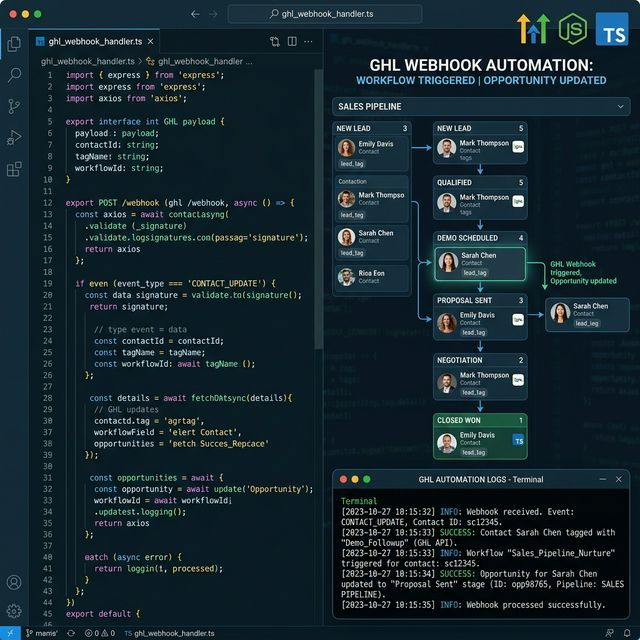

# GoHighLevel CRM Sync Automation

An intelligent middleware server that instantly automates advanced CRM workflows, contact tagging, and pipeline movements in GoHighLevel based on real-time events.

✔ Eliminates manual CRM data entry by automatically syncing cross-platform events
✔ Prevents sales bottlenecks by instantly moving deals to the right pipeline stages
✔ Scales flawlessly using a type-safe Node.js architecture built for high reliability

## Use Cases
- **Sales Automation:** Instantly tag contacts and notify reps the second an opportunity changes stages.
- **Onboarding Workflows:** Automatically trigger Welcome campaigns for new contacts joining the CRM.
- **Data Integrity:** Keep your GoHighLevel CRM perfectly synced with external sales tools and funnels.

---

## Tech Stack

- **Node.js + TypeScript** — strict typing throughout
- **Express** — lightweight HTTP server  
- **GoHighLevel API v2** — full REST client with auth
- **Helmet** — security headers
- **Axios** — HTTP client with interceptors

---

## Setup

```bash
git clone https://github.com/bck-stack/ghl-webhook-automation
cd ghl-webhook-automation
npm install
cp .env.example .env
# Fill in your GHL API key and location ID
npm run dev
```

---

## Endpoints

| Method | Path | Description |
|--------|------|-------------|
| GET | `/health` | Server health check |
| POST | `/webhook/ghl` | Main webhook receiver |
| GET | `/logs` | Last 50 processed events |

---

## GHL Webhook Configuration

1. GHL → Settings → Integrations → Webhooks
2. Set URL: `https://your-domain.com/webhook/ghl`
3. Select events: Contact Create, Contact Update, Opportunity Stage Update
4. Copy the webhook secret to `.env`

---

## Supported Events

| Event | Action |
|-------|--------|
| `ContactCreate` | Add tags, add note, trigger onboarding workflow |
| `ContactUpdate` | Log update |
| `OpportunityCreate` | Tag contact, add note with deal value |
| `OpportunityStageUpdate` | Tag as won/lost based on stage |

---

## Example Payload

```json
{
  "type": "ContactCreate",
  "locationId": "loc_xxxxx",
  "id": "evt_xxxxx",
  "contact": {
    "id": "contact_xxxxx",
    "email": "jane@example.com",
    "firstName": "Jane",
    "tags": []
  },
  "timestamp": "2025-01-15T10:30:00Z"
}
```

---

## Deploy

```bash
npm run build
npm start
# Or with PM2:
pm2 start dist/index.js --name ghl-webhook
```

---

## Screenshot



---

## License

MIT
