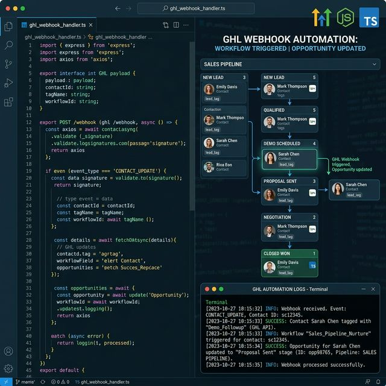

# GoHighLevel CRM Sync Automation

An intelligent middleware server that instantly automates advanced CRM workflows, contact tagging, and pipeline movements in GoHighLevel based on real-time events.

✔ Eliminates manual CRM data entry by automatically syncing cross-platform events
✔ Prevents sales bottlenecks by instantly moving deals to the right pipeline stages
✔ Scales flawlessly using a type-safe Node.js architecture built for high reliability

## Use Cases
- **Sales Automation:** Instantly tag contacts and notify reps the second an opportunity changes stages.
- **Onboarding Workflows:** Automatically trigger Welcome campaigns for new contacts joining the CRM.
- **Data Integrity:** Keep your GoHighLevel CRM perfectly synced with external sales tools and funnels.

---

## Tech Stack

- **Node.js + TypeScript** — strict typing throughout
- **Express** — lightweight HTTP server
- **GoHighLevel API v2** — REST client with retries on 429/5xx (honours `Retry-After`)
- **Helmet** — security headers
- **Vitest + Supertest** — tests

---

## Setup

```bash
git clone https://github.com/bck-stack/gohighlevel-crm-sync-automation
cd gohighlevel-crm-sync-automation
npm install
cp .env.example .env
# Fill in your GHL token, location ID and webhook secret / public key
npm run dev
```

Try it safely first with `DRY_RUN=true` — every CRM action is logged instead of sent.

---

## Project Structure

```
src/
├── index.ts       # start-up, config validation, graceful shutdown
├── app.ts         # Express app, signature check, de-duplication, background processor
├── handlers.ts    # payload normalisation + business rules
├── crm.ts         # GoHighLevel API client (+ dry-run client)
├── signature.ts   # RSA (x-wh-signature) and HMAC (x-ghl-signature) verification
├── config.ts      # environment parsing / validation
└── types.ts
test/app.test.ts   # end-to-end tests with a fake CRM
```

---

## Endpoints

| Method | Path | Description |
|--------|------|-------------|
| GET | `/health` | Server health check |
| POST | `/webhook/ghl` | Main webhook receiver |
| GET | `/logs?status=error&limit=20` | Recent events — requires `X-API-Key` |

---

## How events are handled

1. **Signature** is checked against the **raw request body**: GHL marketplace RSA signatures
   (`x-wh-signature` + `GHL_WEBHOOK_PUBLIC_KEY`) or a shared HMAC secret (`x-ghl-signature`).
2. **Payload is normalised** — GHL's flat payloads (`{ type, id, email, contactId, pipelineStageId, … }`)
   and nested ones (`{ contact: {…} }`) are handled the same way.
3. **Duplicates** (GHL retries, same `webhookId`) are acknowledged but processed once.
4. The endpoint **responds 200 immediately**; actions run in the background, one event at a time,
   with up to 3 attempts. Each event's actions, attempts and errors are visible in `/logs`.
5. Events from another `locationId` are ignored.

---

## GHL Webhook Configuration

1. Marketplace app → Webhooks, or a Workflow with a **Webhook** action
2. Set URL: `https://your-domain.com/webhook/ghl`
3. Select events: Contact Create, Opportunity Create, Opportunity Stage Update, Opportunity Status Update
4. Put GHL's public key in `GHL_WEBHOOK_PUBLIC_KEY` (marketplace) or your shared secret in `GHL_WEBHOOK_SECRET`

---

## Supported Events

| Event | Action |
|-------|--------|
| `ContactCreate` | Add `NEW_LEAD_TAGS` (skips tags already present), add note, trigger onboarding workflow |
| `OpportunityCreate` | Tag contact `opportunity-created`, add note with deal value |
| `OpportunityStageUpdate` / `OpportunityStatusUpdate` | Tag `won` / `lost` by status or configured stage IDs, add note on won, and move deals marked won/lost by status into `GHL_WON_STAGE_ID` / `GHL_LOST_STAGE_ID` |
| `ContactUpdate`, `ContactTagUpdate` | Logged only |

---

## Example Payload (as sent by GoHighLevel)

```json
{
  "type": "ContactCreate",
  "locationId": "loc_xxxxx",
  "webhookId": "whk_xxxxx",
  "id": "contact_xxxxx",
  "email": "jane@example.com",
  "firstName": "Jane",
  "tags": []
}
```

---

## Tests

```bash
npm test          # vitest
npm run typecheck
```

---

## Deploy

```bash
npm run build
npm start
# Or with PM2 (queued events are finished on SIGTERM):
pm2 start dist/index.js --name ghl-webhook
```

---

## Screenshot



---

## License

MIT
